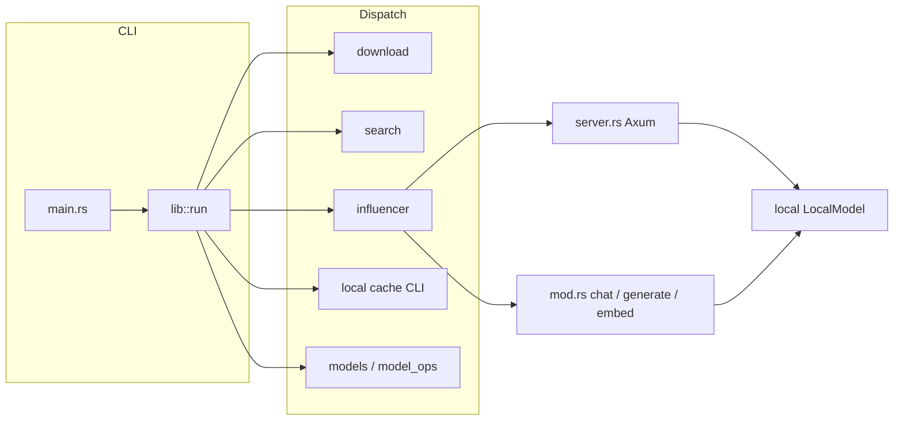

# Architecture

## Layout

Single Cargo package (`model-rs`) with a **library** (`model_rs`) and a **binary** (`model-rs`) sharing `src/`.

| Area | Path | Role |
|------|------|------|
| CLI parsing | `src/cli.rs` | Clap commands and flags |
| Entry / dispatch | `src/lib.rs` `run()` | Loads `.env`, tracing, dispatches subcommands |
| Binary | `src/main.rs` | Calls `model_rs::run()` |
| Config | `src/config.rs` | `MODEL_RS_*` helpers used by CLI and server |
| Download / HF | `src/download.rs`, `src/search.rs` | Pull models; search Hub API |
| Local inference | `src/local/` | Candle-backed `LocalModel`, device selection, generation, optional GGUF/MLX |
| Model index / paths | `src/models.rs`, `src/model_ops.rs` | Listing, `.model_rs_index.json`, resolve `org/model` → cache path |
| HTTP API | `src/influencer/` | Axum app, handlers, shared `AppState` |
| Output | `src/output.rs`, `src/output/code_highlight.rs`, `src/output/markdown_stream.rs`, `src/format.rs` | Terminal markdown, streaming code highlighting |
| Errors | `src/error.rs` | `ModelError`, shared `Result` |

## Control flow

- **Serve path:** `Commands::Serve` / `Deploy` → `influencer::serve` → `server::serve` builds `AppState` (default model path + device), then `get_or_load_model` / generation helpers from `src/local/`.
- **One-shot generate:** `influencer::generate` loads `LocalModel`, enables session KV helpers where needed, streams tokens through `OutputFormatter` / `MarkdownStreamRenderer`.
- **Interactive chat:** `influencer::chat` owns the REPL loop, `ChatSession` JSON persistence, and slash-command handling; calls `LocalModel::generate_text` per turn.

## `src/local/` (inference)

| Module | Role |
|--------|------|
| `mod.rs` | `LocalModel`: load tokenizer, detect architecture, delegate to backend |
| `backends.rs` | Candle weights (and feature-gated GGUF / MLX) |
| `device.rs` | `get_device`, Metal/CUDA/CPU/MLX selection |
| `config.rs` | `LocalModelConfig`, `DevicePreference`, `ModelArchitecture` |
| `architecture.rs` | Detect Llama, Mistral, Mamba, Phi, BERT, Granite, Gemma, Qwen2/3, DeepSeek V2/V3, GLM-4, etc. |
| `generation.rs` | Decode loops, streaming hooks |
| `tokenization.rs` | Tokenizer helpers, streaming pieces |
| `sampling.rs` | `do_sample` (temperature, top-p, top-k) |
| `model_cache.rs` | Process-wide cache: `global_model_cache`, preload/evict |
| `batch.rs` | Batch generation helpers (used by `/v1/generate_batch`) |
| `gguf_backend.rs`, `cache.rs` | Feature `gguf` |
| `mlx_backend.rs` | Feature `mlx` |

`LocalModel` can enable **session KV cache** reuse for chat (see `enable_session_kv_cache` / `clear_session_kv_cache`).

## `src/influencer/`

| File | Role |
|------|------|
| `server.rs` | `build_app`, route handlers, SSE/NDJSON streaming, Ollama request types |
| `mod.rs` | `serve`, `generate`, `embed`, `chat`, session + slash commands |
| `service.rs` | `LlmService` trait (extensibility hook) |

**Routes** are registered in `build_app` (`server.rs`): `/health`, `/v1/generate`, `/v1/generate_stream`, `/v1/generate_batch`, `/api/generate`, `/api/chat`, `/api/show`, `/api/embeddings`, `/api/embed`, `/api/tags`, `/api/delete`, `/api/copy`, `/api/pull`.

## Data paths

- **Application cache:** `ProjectDirs::from("com", "modelrs", "modelrs")`.
- **Models directory:** `cache_dir.join("models")` — used by `ModelOperations::get_models_dir`, downloads, and `resolve_model_path`.
- **HF id → folder:** `org/model` → `models_dir/org--model`.
- **Listing index:** `.model_rs_index.json` in the models directory (`src/models.rs`).

## Features

Optional acceleration and formats are gated in `Cargo.toml`: `metal` (default), `cuda`, `cudnn`, `nccl`, `accelerate`, `gguf`, `mlx`, `mlx-metal`.

## Tests and benches

- `tests/integration_test.rs` — HTTP client against a live server.
- `tests/e2e_test.rs` — CLI subprocess + API checks; binary path via `CARGO_BIN_EXE_model_rs`.
- `benches/throughput.rs` — Criterion bench (`harness = false`).
