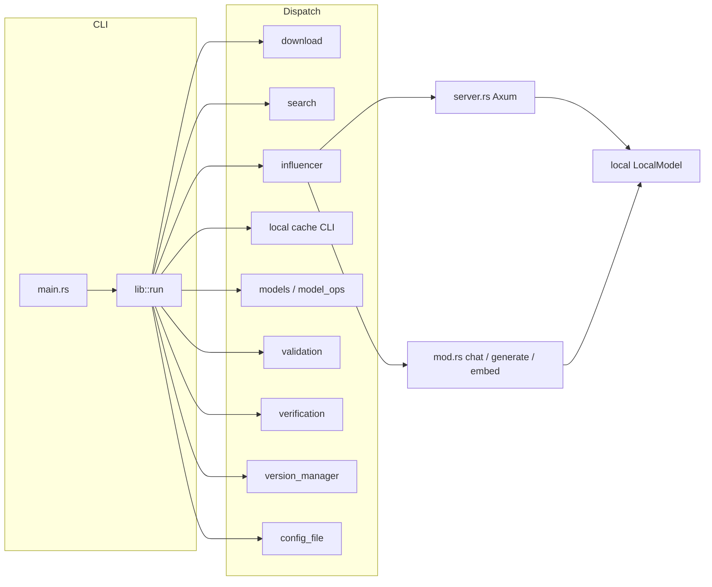

# Architecture

## Layout

Single Cargo package (`model-rs`) with a **library** (`model_rs`) and a **binary** (`model-rs`) sharing `src/`.

| Area | Path | Role |
|------|------|------|
| CLI parsing | `src/cli.rs` | Clap commands and flags, `ConfigCommands`, `VersionCommands` |
| Entry / dispatch | `src/lib.rs` `run()` | Loads `.env`, tracing, dispatches subcommands with validation |
| Binary | `src/main.rs` | Calls `model_rs::run()` |
| Config (env) | `src/config.rs` | `MODEL_RS_*` environment variable helpers |
| Config (file) | `src/config_file.rs` | `ConfigManager`, `AppConfig` (TOML/YAML), config file at `~/.config/model-rs/` |
| Validation | `src/validation.rs` | `ModelValidator`, `HttpValidator`, `DeviceValidator` — input validation for CLI and HTTP |
| Verification | `src/verification.rs` | `ModelVerifier`, `ModelIntegrityManager` — SHA-256 checksum integrity |
| Version manager | `src/version_manager.rs` | `ModelVersionManager`, `VersionManagerCLI` — version tracking, pinning, cleanup |
| Download / HF | `src/download.rs`, `src/search.rs` | Pull models; search Hub API |
| Local inference | `src/local/` | Candle-backed `LocalModel`, device selection, generation, built-in GGUF |
| Model index / paths | `src/models.rs`, `src/model_ops.rs` | Listing, `.model_rs_index.json`, resolve `org/model` → cache path |
| HTTP API | `src/influencer/` | Axum app, handlers, shared `AppState` |
| Output | `src/output.rs`, `src/output/code_highlight.rs`, `src/output/markdown_stream.rs`, `src/format.rs` | Terminal markdown, streaming code highlighting |
| Errors | `src/error.rs` | `ModelError`, shared `Result` |

## Control flow

```mermaid
flowchart LR
  subgraph cli [CLI]
    main[main.rs]
    run[lib::run]
    main --> run
  end
  subgraph dispatch [Dispatch]
    run --> download[download]
    run --> search[search]
    run --> influencer[influencer]
    run --> local[local cache CLI]
    run --> models[models / model_ops]
    run --> validation[validation]
    run --> verification[verification]
    run --> versions[version_manager]
    run --> config[config_file]
  end
  influencer --> server[server.rs Axum]
  influencer --> chat[mod.rs chat / generate / embed]
  server --> local2[local LocalModel]
  chat --> local2
```

- **Serve path:** `Commands::Serve` / `Deploy` → `influencer::serve` → `server::serve` builds `AppState` (default model path + device), then `get_or_load_model` / generation helpers from `src/local/`.
- **One-shot generate:** `influencer::generate` loads `LocalModel`, enables session KV helpers where needed, streams tokens through `OutputFormatter` / `MarkdownStreamRenderer`.
- **Interactive chat:** `influencer::chat` owns the REPL loop, `ChatSession` JSON persistence, and slash-command handling; calls `LocalModel::generate_text` per turn.
- **Validation:** Every subcommand handler in `lib.rs` calls `validation::*` functions before proceeding (model names, paths, ports, device strings, generation params).
- **Verification:** `Commands::Verify` / `GenerateChecksums` → `ModelIntegrityManager` → `ModelVerifier` (SHA-256 checksums in `.model_checksums`).
- **Version management:** `Commands::Versions` → `VersionManagerCLI` → `ModelVersionManager` (version index at `versions/version_index.json`).
- **Config file:** `Commands::Config` subcommands → `ConfigManager` (TOML/YAML at `~/.config/model-rs/config.toml`), merged with env vars and defaults.

## `src/local/` (inference)

| Module | Role |
|--------|------|
| `mod.rs` | `LocalModel`: load tokenizer, detect architecture, delegate to backend |
| `backends.rs` | Candle weights (GGUF always available via candle's quantized models) |
| `device.rs` | `get_device`, Metal/CPU selection (CUDA/MLX removed) |
| `config.rs` | `LocalModelConfig`, `DevicePreference`, `ModelArchitecture` |
| `architecture.rs` | Detect Llama, Mistral, Mamba, Phi, BERT, Granite, Gemma, Qwen2/3, DeepSeek V2/V3, GLM-4, etc. |
| `generation.rs` | Decode loops, streaming hooks |
| `tokenization.rs` | Tokenizer helpers, streaming pieces |
| `sampling.rs` | `do_sample` (temperature, top-p, top-k) |
| `model_cache.rs` | Process-wide cache: `global_model_cache`, preload/evict |
| `batch.rs` | Batch generation helpers (used by `/v1/generate_batch`) |
| `gguf_backend.rs`, `cache.rs` | GGUF quantized inference (always available, uses candle's `quantized_llama::ModelWeights`) |

`LocalModel` can enable **session KV cache** reuse for chat (see `enable_session_kv_cache` / `clear_session_kv_cache`).

## `src/influencer/`

| File | Role |
|------|------|
| `server.rs` | `build_app`, route handlers, SSE/NDJSON streaming, Ollama request types |
| `mod.rs` | `serve`, `generate`, `embed`, `chat`, session + slash commands |
| `service.rs` | `LlmService` trait (extensibility hook) |

**Routes** are registered in `build_app` (`server.rs`): `/health`, `/v1/generate`, `/v1/generate_stream`, `/v1/generate_batch`, `/api/generate`, `/api/chat`, `/api/show`, `/api/embeddings`, `/api/embed`, `/api/tags`, `/api/delete`, `/api/copy`, `/api/pull`.

## Data paths

- **Application cache:** `ProjectDirs::from("com", "modelrs", "modelrs")`.
- **Models directory:** `cache_dir.join("models")` — used by `ModelOperations::get_models_dir`, downloads, and `resolve_model_path`.
- **HF id → folder:** `org/model` → `models_dir/org--model`.
- **Listing index:** `.model_rs_index.json` in the models directory (`src/models.rs`).

## Features

Only one optional feature remains in `Cargo.toml`: `metal` (default, pure Rust Metal FFI to macOS system framework). All other features (`gguf`, `mlx`, `mlx-metal`, `accelerate`, `cuda`, `cudnn`, `nccl`) have been removed. GGUF quantized inference is always available via candle's pure Rust `quantized::gguf_file` + `quantized_llama::ModelWeights`. Candle crates are vendored under `vendor/` with a `fancy-regex` patch replacing `onig` (C regex). No C/C++ compiler is required to build.

## Tests and benches

- `tests/integration_test.rs` — HTTP client against a live server.
- `tests/e2e_test.rs` — CLI subprocess + API checks; binary path via `CARGO_BIN_EXE_model_rs`.
- `tests/api_error_test.rs` — API error handling and edge-case coverage.
- `tests/error_handling_test.rs` — Validation, model errors, and recovery paths.
- `benches/throughput.rs` — Criterion bench (`harness = false`).

**Test totals:** 227 tests (159 lib + 12 API error + 33 E2E + 16 error handling + 7 integration), all passing.
